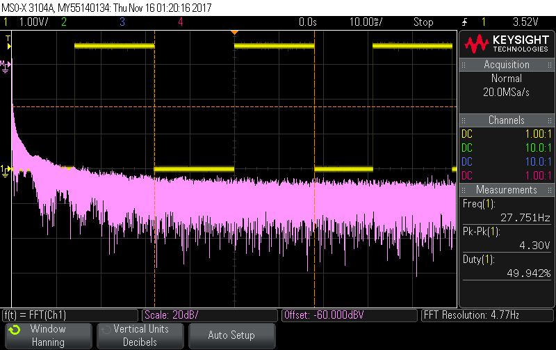
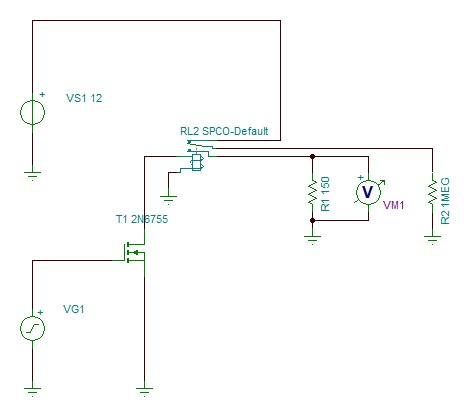

# Lab 6: "High Power" Control

This sub-folder contains the code for high-power control systems.

## Dependencies

This code requires the MSP430G2553 header file. 
```c
#include <msp430g2553.h>
```

## Function

This code produces a PWM, 50% duty cycle square wave output on `P1.2`. The first peripheral function is set on `P1.2` which is tied to the `CCR1` output. `CCTL0` is configured with `OUTMOD_7` which is "reset/set". Lowest DCOx and MOD settings used.

```c
void main(void)
{
    WDTCTL = WDTPW + WDTHOLD; // Stop watchdog timer
    DCOCTL  = 0;              // Select lowest DCOx and MODx settings
    BCSCTL1 = CALBC1_1MHZ;    // Set DCO
    DCOCTL  = CALDCO_1MHZ;

    // initialize LED
    P1SEL|=BIT2;    // Select peripheral mode for P1.2 and P1.3
    P1DIR|=BIT2;    // Set pins to output direction
    P1OUT&=~BIT2;   // Set the pins low

    // initialize Timer
    CCR0=511; // Timer A0 Period
    CCTL1|=OUTMOD_7; // Output = Reset/Set
    CCR1=254; // 50% duty cycle
    TACTL|=TASSEL_1+MC_1+TACLR; // SMCLK, Continuous mode

    __bis_SR_register(LPM3_bits+GIE); // LPM0 with interrupts enabled
}
```

## Elaboration

In this lab, a high-power system is designed and built on a breadboard. The system has a low-current input and a high-current output. The input, or control, in this system comes from the G2553. The output is able to drive a 1W power resistor with +12V. This is made possible with relay and MOSFET switching.

The input of this system is connected to `P1.2` on the G2553. Observing the output on `P1.2` on an oscilloscope, you will see something similar to this: 
 
. 

In this oscilloscope screenshot, the output on `P1.2` is a square wave with a frequency of 27.8Hz and a 50% duty cycle. This is the input to the control side.

With relay and MOSFET switching, it is possible to drive a high-power output with a very low-current input. Switching requires a modulated signal, which the G2553 is able to generate. These two types of high-power control are similar in function, but each has its own limitations and benefits.

### Relay Switching

The diagram below shows how a simple relay operates. 
 
. 

It's basically an electromechanical switch: a current is driven into a coil, which generates a magnetic field, which closes a switch. This is a simple method of driving systems that draw much larger currents with small-current inputs. However, improper design can cause current to flow back into and damage the microcontroller.

A simple yet proper design for a relay switching circuit can be seen in the figure below. 

 

When the signal from the MSP430 is low, or zero, the relay will be open and the +12V battery will be connected to the 1Mohm resistor. When the signal is high, the switch will close and connect the +12V battery to the power resistor. In either case, the microprocessor is protected against back current flow because of the NMOS transistor.

### MOSFET Switching

MOSFET switching works similar to relay switching (and requires one less relay to work properly!). 