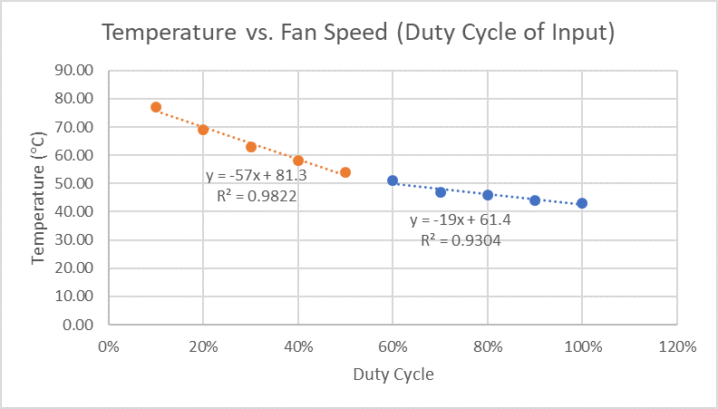

# Lab 6: Open Loop Systems

This sub-folder contains the code for Lab 6: Open Loop Systems by Damon Boorstein, Brendan Nugent, and Stephen Glass.
## Dependencies

This code requires two header files: one for the MSP430FR6989

```c
#include <msp430fr6989.h>
```

and one for the LCD Driver.

```c
#include "LCDDriver.h"
```

## Usage

This project was debugged and is intended to be debugged in Code Composer Studio. Create a new project with the FR6989 as the target configuration. Include the three files in the source code folder in the project and debug.

## Function

Given a desired temperature, this code sets a PWM duty cycle. It is intended to be used in a system with a linear regulator, a temperature sensor to monitor the regulator's temperature, and a fan to control this temperature. The duty-cycle-to-temperature relationship was determined through experimentation.

## Elaboration

We powered a fan with 14V and PWM'ed its speed using this code, which initializes Timer A to perform PWM:

```c
void initPWM(void)
{
    TA0CTL = (MC__UP + TASSEL__SMCLK); // Configure TA0: Upmode using 1MHz clock / 4 = 250k
    TA0CCR0 = 100; // 250k / 255 = ~1kHz, set compare to 255

    TA0CCTL1 = OUTMOD_7;
    TA0CCR1  = 20; // Green
}
```

Then, we built the following circuit:


We then incremented the duty cycle by 10% and observed the voltage using a DMM and converted this to a temperature. The voltage output of the LM35 is calibrated to the centigrate temperature scale (10mV/°C), so this was a simple conversion.

Our results can be seen in the following table.

**Temperature for Fan Speed**

| Duty Cycle (%) | Temperature (degC) |
|:--------------:|:------------------:|
| 10             | 77                 |
| 20             | 69                 |
| 30             | 63                 |
| 40             | 58                 |
| 50             | 54                 |
| 60             | 51                 |
| 70             | 47                 |
| 80             | 46                 |
| 90             | 44                 |
| 100            | 43                 |

We then generated a graph in Excel.

 

Temperature can then be represented in a piecewise function. In the code, when the temperature is less than or equal to 54°C, this function is used:

```c
if(temp >= 54) // first piecewise function
{
   duty = (int)(-1.754386*(temp-81.3));
}
```

...and when it is greater, this function:

```c
else
{
    duty = (int)(-5.263158*(temp-61.4));
}
```

So, finally, the integer argument in the `setTemperature()` function will set the duty cycle output based on the calculated value, thereby setting the speed of the fan. 